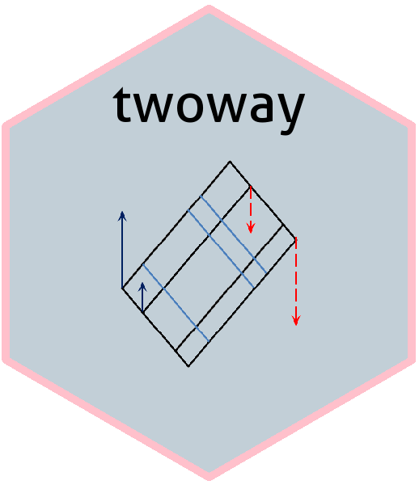

<!-- badges: start -->
[](https://www.repostatus.org/#active)
[](https://cran.r-project.org/package=twoway)
[](https://cran.r-project.org/package=twoway)
[](https://travis-ci.org/friendly/twoway)
<!-- badges: end -->


<!-- [](https://www.gnu.org/licenses/gpl-3.0.en.html) -->

<!-- README.md is generated from README.Rmd. Please edit that file -->

```{r, echo = FALSE}
knitr::opts_chunk$set(
  collapse = TRUE,
  comment = "#>",
  fig.path = "README-"
)
```

# twoway 
**Analysis of Two-Way Tables a la Tukey**

Version: ```r packageVersion("twoway")```

The `twoway` package provides analysis and graphical methods for two-way tables with one observation per cell,
most typically used in an Analysis of Variance (ANOVA) context.
The methods follow Tukey (1949), "One Degree of Freedom for Non-additivity", explained more concretely in Tukey (1972), *Exploratory Data Analysis*,
but the graphical ideas are more interesting and general:

* How to display an **assumed** additive relation between two factors graphically, and visualize departures from an additive fit?
* How to assess **visually** whether a power transformation of the response might be more nearly additive in the factors?

The goal of the package is to introduce these ideas in R, and allow further development.
This R implementation is based on my SAS macro, [twoway.sas](http://www.datavis.ca/sasmac/twoway.html). 

## Installation

This currently released package can be installed directly from CRAN:
```{r install-cran, eval=FALSE}
install.packages("twoway")
```


You can install the development version `twoway` from github with:

```{r gh-installation, eval = FALSE}
# install.packages("devtools")
devtools::install_github("friendly/twoway")
```

## Example

A trivial example shows the analysis of a 3 x 3 table, containing mean reaction times for three subjects
presented with three types of sentences and asked to judge whether the sentence was TRUE or FALSE.
The questions are:

* How does reaction time vary with subject and sentence type?
* Can the results be accounted for by an additive model, with an effect for subject and for sentence type?
* Are there any unusual observations that deviate from an additive model?
* If there are systematic departures from additivity, could a power transformation of the response
(1/x, log(x), sqrt(x), $x^2$, ...) make the simpler additive model more tenable, and more easily understood?

```{r ex1-data}
library(twoway)
data("sentRT")
sentRT
```

The `twoway()` function gives the basic analysis: a decomposition of the two-way table, giving the:

* grand mean ($\mu = \bar{x}_{..}$), 
* row effects ($\alpha_i = \bar{x}_{i.}-\mu$), 
* column effects ($\beta_j = \bar{x}_{.j}-\mu$), and
* residuals ($x_{ij}-\mu -\alpha_i -\beta_j$)

```{r ex1-twoway}
sent.2way <- twoway(sentRT)
print(sent.2way)
```

`twoway()` also allows for a robust fitting by row and column medians, using Tukey's idea of median polish, as implemented
in `stats::medpolish()`. This uses `method="median"` in the call to `twoway()`.


```{r ex2-twoway}
print(twoway(sentRT, method="median"), border=2)
```
The result is much simpler, in that most residuals are closer to 0, and one large one stands out.

### Plot methods
The plot method for `twoway` objects currently provides two types of plots:

* a plot of fitted values under the additive models and residuals (the default, `which="fit"`)
* a diagnostic plot of interaction residuals vs. comparison values under additivity (`which="diagnose"`). 

```{r ex1-plot}
plot(sent.2way)
```

The diagnostic plot shows the regression of residuals under the additive model against the comparison values under the additive model. If the points in this plot are reasonably
linear and have a non-zero slope, *b*, a suggested power transformation of the response to $x^{1-b}$ will often remove
non-additivity.
```{r ex1-plot2}
plot(sent.2way, which="diagnose")
```

There is an opposite-corner pattern to the residuals in the analysis by means. In the diagnostic plot, the positive slope,
$b=1.6$ suggests a power transformation $x^{1-b} = x^{-0.6}$, which can be taken as close to $1 / \sqrt{x}$.
Alternatively, reaction time data is often more easily analyzed by classical methods and the results more easily understood
in terms of *response speed*, using the transformation $1/x$.

### anova method

In the present version, the `anova()` method for a `"twoway"` object gives the results of two analyses: one for the additive
model, and one for the model allowing 1 df for non-additivity. Both of these assume
that row and column effects are fit using means (`method="mean"`).

```{r}
anova(sent.2way)
```

There is a variety of other tests for additivity in twoway tables with $n=1$ per cell.
A number of these are implemented in the [additivityTests package](https://cran.r-project.org/package=additivityTests).

### Other methods and functions

* The `as.data.frame()` method for a `"twoway"` object gives a tidy data.frame result, containing the components of the fitted
values and other quantities.

```{r, R.options=list(digits=3)}
as.data.frame(sent.2way)
```

* The utility functions `to_long()` and `to_wide()` facilitate conversion between matrix format and a long format
with variables such as `Row`, `Col` and `Value`.

## TODOs

This package is at a middle stage of development.  There are some small **TODO**s scattered throughout the code.  In addition:

<!-- * Implement a proper `anova.twoway()` method, giving a comprehensive analysis of variance table, including the Tukey 1 df test for non-additivity. The present version is just an initial sketch. -->
<!-- * Create a formula method for a `data.frame` with columns like `row, col, value` as might be used in `twoway(value ~ row + col, data=)`. -->

* It would be nicer to use the names of the row and column variables in some displays, rather than `Row` and `Col`.
