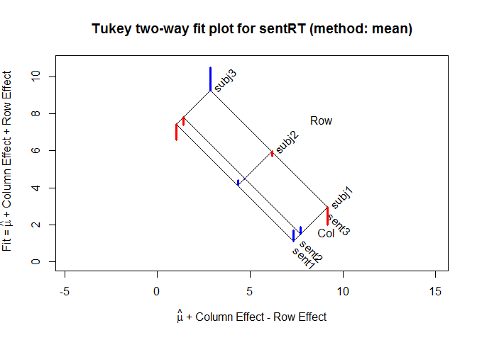
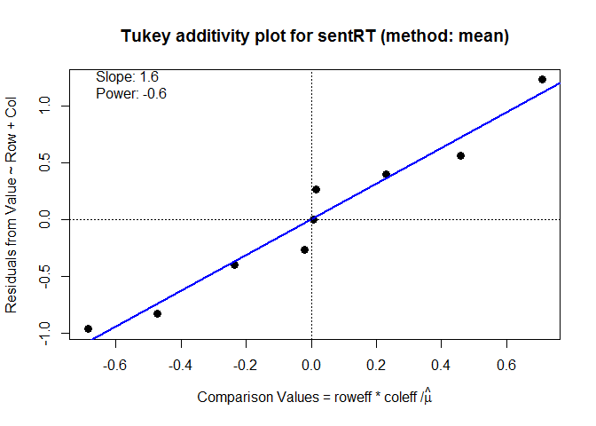

<!-- badges: start -->

[](https://www.repostatus.org/#active)
[](https://cran.r-project.org/package=twoway)
[](https://cran.r-project.org/package=twoway)
[](https://travis-ci.org/friendly/twoway)
<!-- badges: end -->

<!-- [](https://www.gnu.org/licenses/gpl-3.0.en.html) -->

<!-- README.md is generated from README.Rmd. Please edit that file -->

# twoway 

**Analysis of Two-Way Tables a la Tukey**

Version: 0.6.3

The `twoway` package provides analysis and graphical methods for two-way
tables with one observation per cell, most typically used in an Analysis
of Variance (ANOVA) context. The methods follow Tukey (1949), “One
Degree of Freedom for Non-additivity”, explained more concretely in
Tukey (1972), *Exploratory Data Analysis*, but the graphical ideas are
more interesting and general:

  - How to display an **assumed** additive relation between two factors
    graphically, and visualize departures from an additive fit?
  - How to assess **visually** whether a power transformation of the
    response might be more nearly additive in the factors?

The goal of the package is to introduce these ideas in R, and allow
further development. This R implementation is based on my SAS macro,
[twoway.sas](http://www.datavis.ca/sasmac/twoway.html).

## Installation

This currently released package can be installed directly from CRAN:

``` r
install.packages("twoway")
```

You can install the development version `twoway` from github with:

``` r
# install.packages("devtools")
devtools::install_github("friendly/twoway")
```

## Example

A trivial example shows the analysis of a 3 x 3 table, containing mean
reaction times for three subjects presented with three types of
sentences and asked to judge whether the sentence was TRUE or FALSE. The
questions are:

  - How does reaction time vary with subject and sentence type?
  - Can the results be accounted for by an additive model, with an
    effect for subject and for sentence type?
  - Are there any unusual observations that deviate from an additive
    model?
  - If there are systematic departures from additivity, could a power
    transformation of the response (1/x, log(x), sqrt(x), \(x^2\), …)
    make the simpler additive model more tenable, and more easily
    understood?

<!-- end list -->

``` r
library(twoway)
data("sentRT")
sentRT
#>       sent1 sent2 sent3
#> subj1   1.7   1.9   2.0
#> subj2   4.4   4.5   5.7
#> subj3   6.6   7.4  10.5
```

The `twoway()` function gives the basic analysis: a decomposition of the
two-way table, giving the:

  - grand mean (\(\mu = \bar{x}_{..}\)),
  - row effects (\(\alpha_i = \bar{x}_{i.}-\mu\)),
  - column effects (\(\beta_j = \bar{x}_{.j}-\mu\)), and
  - residuals (\(x_{ij}-\mu -\alpha_i -\beta_j\))

<!-- end list -->

``` r
sent.2way <- twoway(sentRT)
print(sent.2way)
#> 
#> Mean decomposition (Dataset: "sentRT"; Response: Value)
#> Residuals bordered by row effects, column effects, and overall
#> 
#>          sent1    sent2    sent3      roweff  
#>        + -------- -------- -------- + --------
#> subj1  |  0.56667  0.40000 -0.96667 : -3.10000
#> subj2  |  0.26667  0.00000 -0.26667 : -0.10000
#> subj3  | -0.83333 -0.40000  1.23333 :  3.20000
#>        + ........ ........ ........ + ........
#> coleff | -0.73333 -0.36667  1.10000 :  4.96667
```

`twoway()` also allows for a robust fitting by row and column medians,
using Tukey’s idea of median polish, as implemented in
`stats::medpolish()`. This uses `method="median"` in the call to
`twoway()`.

``` r
print(twoway(sentRT, method="median"), border=2)
#> 
#> Median polish decomposition (Dataset: "sentRT"; Response: Value)
#> Residuals bordered by row effects, column effects, and overall
#> 
#>          sent1 sent2 sent3   roweff
#>        + ----  ----  ----  + ----  
#> subj1  |  0.0   0.0  -1.1  : -2.6  
#> subj2  |  0.1   0.0   0.0  :  0.0  
#> subj3  | -0.6   0.0   1.9  :  2.9  
#>        + ....  ....  ....  + ....  
#> coleff | -0.2   0.0   1.2  :  4.5
```

The result is much simpler, in that most residuals are closer to 0, and
one large one stands out.

### Plot methods

The plot method for `twoway` objects currently provides two types of
plots:

  - a plot of fitted values under the additive models and residuals (the
    default, `which="fit"`)
  - a diagnostic plot of interaction residuals vs. comparison values
    under additivity (`which="diagnose"`).

<!-- end list -->

``` r
plot(sent.2way)
```

<!-- -->

The diagnostic plot shows the regression of residuals under the additive
model against the comparison values under the additive model. If the
points in this plot are reasonably linear and have a non-zero slope,
*b*, a suggested power transformation of the response to \(x^{1-b}\)
will often remove non-additivity.

``` r
plot(sent.2way, which="diagnose")
```

<!-- -->

    #> Slope of Residual on comparison value:  1.6 
    #> Suggested power transformation:         -0.6 
    #> Ladder of powers transformation:        reciprocal root

There is an opposite-corner pattern to the residuals in the analysis by
means. In the diagnostic plot, the positive slope, \(b=1.6\) suggests a
power transformation \(x^{1-b} = x^{-0.6}\), which can be taken as close
to \(1 / \sqrt{x}\). Alternatively, reaction time data is often more
easily analyzed by classical methods and the results more easily
understood in terms of *response speed*, using the transformation
\(1/x\).

### anova method

In the present version, the `anova()` method for a `"twoway"` object
gives the results of two analyses: one for the additive model, and one
for the model allowing 1 df for non-additivity. Both of these assume
that row and column effects are fit using means (`method="mean"`).

``` r
anova(sent.2way)
#> Dataset: sentRT; method: "mean"
#> 
#> Analysis of Variance Table, assuming additivity
#> 
#>           Df Sum Sq Mean Sq F value   Pr(>F)   
#> row        2 59.580 29.7900 30.2949 0.003835 **
#> col        2  5.647  2.8233  2.8712 0.168574   
#> Residuals  4  3.933  0.9833                    
#> ---
#> Signif. codes:  0 '***' 0.001 '**' 0.01 '*' 0.05 '.' 0.1 ' ' 1
#> 
#> 
#> Analysis of Variance Table, allowing non-additivity
#> 
#>            Df Sum Sq Mean Sq F value    Pr(>F)    
#> row         2 59.580 29.7900 513.449 0.0001572 ***
#> col         2  5.647  2.8233  48.662 0.0051710 ** 
#> nonadd      1  3.759  3.7593  64.793 0.0040046 ** 
#> pure error  3  0.174  0.0580                      
#> ---
#> Signif. codes:  0 '***' 0.001 '**' 0.01 '*' 0.05 '.' 0.1 ' ' 1
```

There is a variety of other tests for additivity in twoway tables with
\(n=1\) per cell. A number of these are implemented in the
[additivityTests
package](https://cran.r-project.org/package=additivityTests).

### Other methods and functions

  - The `as.data.frame()` method for a `"twoway"` object gives a tidy
    data.frame result, containing the components of the fitted values
    and other quantities.

<!-- end list -->

``` r
as.data.frame(sent.2way)
#>     row   col data  fit  dif residual roweff coleff   nonadd
#> 1 subj1 sent1  1.7 1.13 7.33    0.567   -3.1 -0.733  0.45772
#> 2 subj2 sent1  4.4 4.13 4.33    0.267   -0.1 -0.733  0.01477
#> 3 subj3 sent1  6.6 7.43 1.03   -0.833    3.2 -0.733 -0.47248
#> 4 subj1 sent2  1.9 1.50 7.70    0.400   -3.1 -0.367  0.22886
#> 5 subj2 sent2  4.5 4.50 4.70    0.000   -0.1 -0.367  0.00738
#> 6 subj3 sent2  7.4 7.80 1.40   -0.400    3.2 -0.367 -0.23624
#> 7 subj1 sent3  2.0 2.97 9.17   -0.967   -3.1  1.100 -0.68658
#> 8 subj2 sent3  5.7 5.97 6.17   -0.267   -0.1  1.100 -0.02215
#> 9 subj3 sent3 10.5 9.27 2.87    1.233    3.2  1.100  0.70872
```

  - The utility functions `to_long()` and `to_wide()` facilitate
    conversion between matrix format and a long format with variables
    such as `Row`, `Col` and `Value`.

## TODOs

This package is at a middle stage of development. There are some small
**TODO**s scattered throughout the code. In addition:

<!-- * Implement a proper `anova.twoway()` method, giving a comprehensive analysis of variance table, including the Tukey 1 df test for non-additivity. The present version is just an initial sketch. -->

<!-- * Create a formula method for a `data.frame` with columns like `row, col, value` as might be used in `twoway(value ~ row + col, data=)`. -->

  - It would be nicer to use the names of the row and column variables
    in some displays, rather than `Row` and `Col`.
